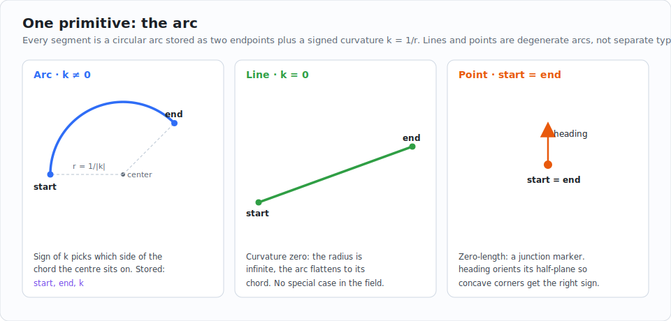
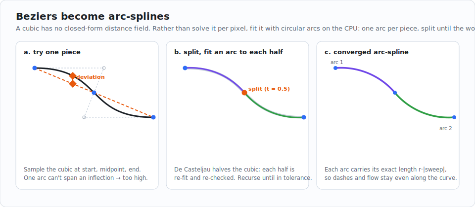
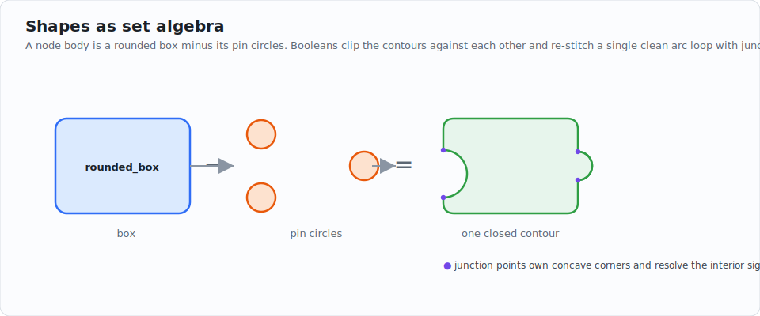
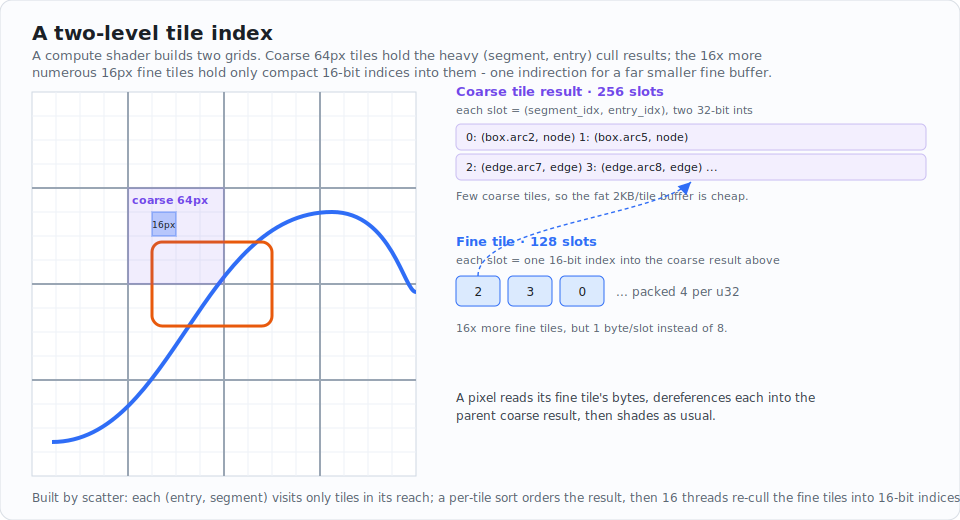
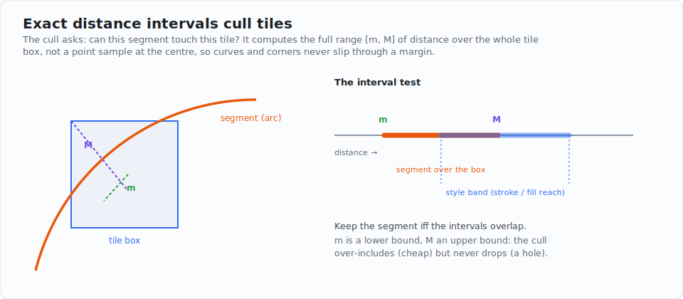
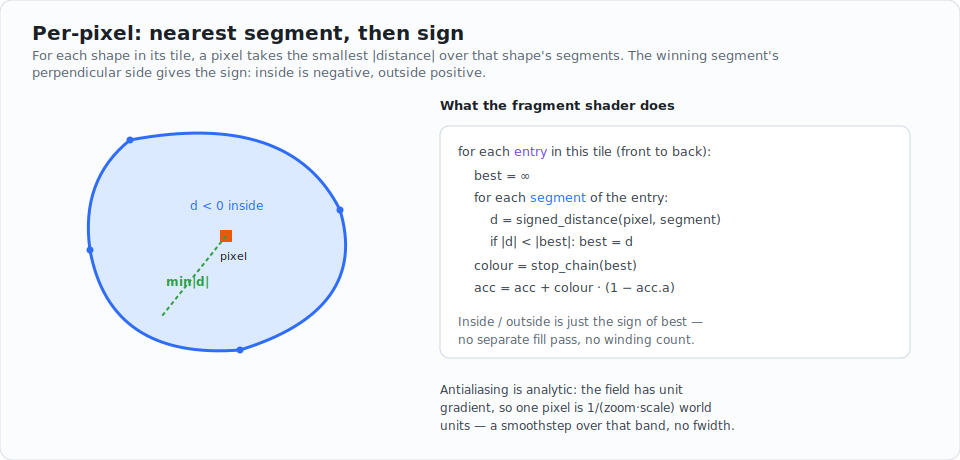
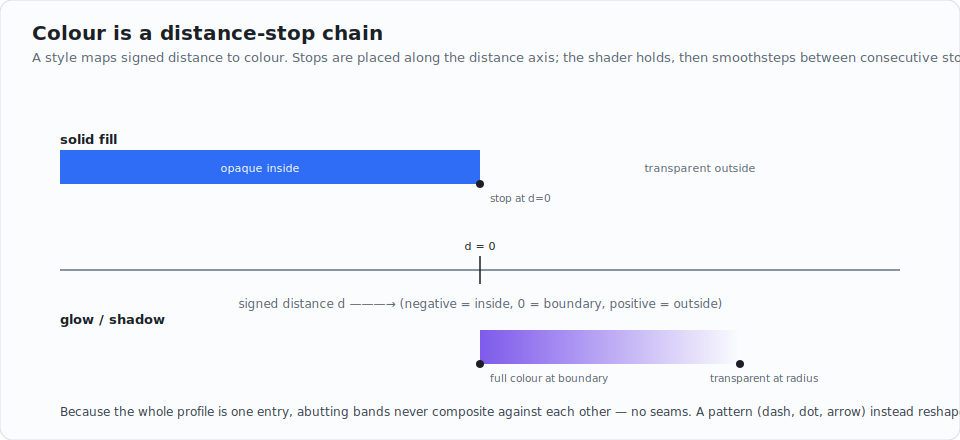

# Arcs is all you need!

**A segment-based signed-distance-field renderer for 2D vector graphics on the GPU.**

`iced_nodegraph_sdf` draws nodes, edges, pins, and backgrounds for
[`iced_nodegraph`](../iced_nodegraph) as exact, resolution-independent distance
fields. It stays sharp at any zoom, fills and strokes and glows from the same
math, and renders a graph of hundreds of nodes and edges from a handful of GPU
buffers.

This README is written as a *guide to the architecture*, not a tour of the
source. The design generalises: if you want to build a vector renderer that is
crisp, compositional, and cheap, the decisions below are the interesting part,
and this crate is one worked example of them. Each section follows the data as
it flows from the API you call down into the fragment shader.

---

## The thesis

Drawing 2D vector graphics on a GPU usually means one of two things:

- **Tessellate** every shape into triangles. Fast to raster, but strokes,
  rounded joins, and antialiasing become geometry problems, zooming re-tessellates,
  and a crisp 1px outline is a fight.
- **Hand-write a signed distance function per shape.** A box SDF, a rounded-box
  SDF, a line SDF, a bezier SDF, an arc SDF... each its own branch, each its own
  bugs, and combining them (a box *minus* its pin holes) means compositing
  separate fields, which seams.

Both scale badly as the vocabulary of shapes grows. This crate takes a different
bet:

> **Collapse all geometry to one primitive, and one evaluator. The primitive is
> the circular arc.**

A straight line is an arc of infinite radius. A point is an arc of zero length.
A cubic bezier is a short *spline* of arcs. A rounded box, a circle, a node body
with pin cutouts — all are closed loops of arcs. The renderer therefore knows
exactly *one* distance function, evaluated the same way for every shape. There is
no shape zoo, no per-type branch in the hot path, and no compositing seam,
because a compound shape is *one* contour of arcs, not several fields stacked.

Everything else in the system — the spatial index, the styling, the caching —
follows from having a single, uniform, cheap-to-evaluate primitive.

---

## The pipeline at a glance


Five stages. The first three run on the CPU, once per frame (and most of that
work is skipped when nothing changed — see [Performance](#performance-why-this-is-fast)).
The last two run on the GPU: one compute dispatch builds a spatial index, one
draw call shades every pixel.

| Stage | Where | Input | Output |
|-------|-------|-------|--------|
| 1. Author | your code | `Shape` + `Style` + position | a queued draw |
| 2. Evaluate | CPU | the shape recipe | arcs in a local frame |
| 3. Compile | CPU | arcs + styles | three flat GPU buffers |
| 4. Index | GPU compute | the buffers | per-tile segment lists |
| 5. Shade | GPU fragment | tiles + buffers | pixels |

---

## Part 1 &middot; The one primitive

Every drawn segment is a single arc, stored as **two endpoints plus a signed
curvature** `k = 1/r`:



```
curvature k == 0      ->  straight line  start -> end
start == end          ->  point (junction marker; heading orients its sign)
otherwise             ->  minor arc of radius 1/|k|, bulging to the side sign(k) picks
```

This `Segment` (see [`src/drawable.rs`](src/drawable.rs)) and its distance field
(see [`src/segment.rs`](src/segment.rs)) are the whole geometric vocabulary.

**Why endpoints, not center/radius/sweep?** A center-based encoding cannot
express a straight line as a degenerate arc — the limit is `radius -> infinity`,
which is unstorable and is the classic source of "a near-straight edge suddenly
renders as a giant arc / full circle" artifacts. Endpoints degenerate to a line
*cleanly* at `k = 0`, and they keep a segment's numbers near its own coordinates,
which avoids the precision loss a far-from-origin center form suffers. The full
center/radius/sweep is reconstructed on demand, on both CPU and GPU, from
endpoints + curvature — and a regression test proves the reconstructed field
matches the legacy center-form field to within `1e-2` everywhere.

**One discipline keeps it unambiguous:** every stored arc is a *minor* arc
(`|sweep| < pi`). A wider arc — a full-circle pin is `2*pi` — is split into minor
sub-arcs before it is stored (a full circle becomes four quarters). With that
invariant the minor-arc reconstruction is always well-defined.

### Beziers become arc-splines

A cubic bezier has no closed-form distance field; evaluating it per pixel means
Newton iteration plus arc-length quadrature — the single most expensive thing a
shader of this kind can do. So this crate does not. It approximates each cubic
with arcs *on the CPU*, before anything reaches the GPU:



The fit (see [`src/biarc.rs`](src/biarc.rs)) is adaptive subdivision: fit one arc
through a piece's two endpoints and its midpoint, measure the worst deviation of
the true cubic from that arc, and if it exceeds tolerance, split the piece in half
(de Casteljau) and recurse. A near-flat piece becomes a line instead. The
tolerance is a fixed 0.05 world units — at most half a pixel of screen error
across the widget's whole zoom range, and fixed on purpose, so a shape's recipe
hash stays zoom-invariant and zooming never re-fits resident geometry. Each
emitted arc carries its **exact** arc length (`r * |sweep|`), which keeps
dash spacing and flow animation even along the curve.

The payoff is that the GPU's distance evaluator only ever sees a line or a minor
arc. The entire cubic branch — the expensive one — does not exist on the GPU.

---

## Part 2 &middot; Authoring: shapes and styles

You describe *what* to draw with two values, then queue it.

**A `Shape` is a position-free expression tree** (see [`src/shape.rs`](src/shape.rs)).
It is a *recipe*, not evaluated geometry — primitives and set operations, built in
a local frame centered on the shape's own origin:

```rust
use iced_nodegraph_sdf::Shape;

// A node body: a rounded box with two pin cutouts, authored as set algebra.
let node = Shape::rounded_box([160.0, 90.0], [8.0; 4])
    - Shape::circle(5.0).translate([-80.0, -20.0])   // `-` = difference
    - Shape::circle(5.0).translate([ 80.0,  20.0]);
```

`-` is difference, `|` is union, `&` is intersection, `.translate(..)` shifts.
Because the recipe is position-free, *where* it lands in the world is a separate
argument at queue time — a distinction Part 3 turns into a major speedup.

**A `Style` is a distance-stop chain** (see [`src/style.rs`](src/style.rs)) — a
function from signed distance to colour, plus an optional stroke `Pattern`. The
constructors cover the common cases:

```rust
use iced_nodegraph_sdf::{Style, Pattern};
use iced::Color;

let fill   = Style::solid(Color::WHITE);                       // opaque interior
let stroke = Style::stroke(Color::BLACK, Pattern::solid(2.0)); // 2px outline
let glow   = Style::shadow(Color::BLACK, 12.0);                // outward fade
```

Part 7 explains how the stop chain produces fills, strokes, and glows from one
mechanism. For now: a style is just colour-as-a-function-of-distance.

**Queue the draw** onto an `SdfPrimitive` (see [`src/primitive.rs`](src/primitive.rs)),
giving the shape, its style, and a world position:

```rust
use iced_nodegraph_sdf::SdfPrimitive;

let mut prim = SdfPrimitive::new();
prim.push(&node, &fill,   [300.0, 200.0]);  // body fill
prim.push(&node, &stroke, [300.0, 200.0]);  // body outline, same geometry
let prim = prim.camera(cam_x, cam_y, zoom).time(elapsed);
```

Each `push` is one draw: a fill, an outline, a glow, an edge. A node with a fill,
a border, and a shadow is three pushes of the *same* shape with three styles.
That repetition is deliberate — Part 3 makes it nearly free.

---

## Part 3 &middot; Evaluate: recipe to arcs

Now the recipe becomes geometry. This is where the shape tree is walked and
turned into arcs in its local frame (see `Shape::evaluate` in
[`src/shape.rs`](src/shape.rs)).

**Set operations clip and re-stitch.** A renderer that combined shapes by
`min`/`max` of distance fields would seam at the joins and mis-sign concave
corners. Instead, booleans (see [`src/boolean.rs`](src/boolean.rs)) clip the two
contours against each other and stitch the surviving boundary into *one* clean
loop of arcs, inserting junction points at corners:



The result is a single closed contour. The renderer never knows it was built from
a box and three circles — it sees one loop of arcs, which is exactly why the
compound shape has no internal seams.

**Two ideas make this cheap at scale:**

- **Content-addressed caching.** A shape's recipe is hashed structurally — the
  primitive parameters, the op codes, and the sub-hashes — *not* the evaluated
  arcs. The hash is placement-independent and platform-stable (FNV-1a over
  canonicalised float bytes, so `-0.0 == 0.0` and native matches wasm). Two
  independently-built copies of the same node body hash equal, so the expensive
  boolean re-stitch runs **once** and every later identical shape is a cache hit.
  A frame-surviving LRU cache (see `ShapeCache`) means a static graph re-evaluates
  *nothing*. Ephemeral geometry whose arcs change every frame (a dragged edge)
  is deliberately *not* cacheable, so it never churns the cache.

- **The keystone: local frame + per-instance placement.** Geometry is stored
  centered on the shape's own origin; the world position rides separately as a
  per-instance *translate*. Because translation preserves distance (`|grad| = 1`),
  the rendered result is independent of where the translate puts it — so 500
  identical nodes at 500 positions share **one** evaluated shape, differing only
  in a two-float offset. This is what makes the cache and the GPU instancing in
  Part 4 possible.

---

## Part 4 &middot; Compile: three flat buffers

Evaluated arcs and styles are packed into three flat GPU buffers (see
[`src/compile.rs`](src/compile.rs) and [`src/pipeline/types.rs`](src/pipeline/types.rs)):

| Buffer | One element is | Size |
|--------|----------------|------|
| **segments** | one arc (endpoints, curvature, arc-length range) | 64 B |
| **entries** | one draw command (which segments, which style, the per-instance translate) | 64 B |
| **styles** | one compiled stop chain + pattern | ~340 B |

An *entry* is a draw command: it points at a contiguous range of segments, names
a style, carries the world translate, and holds the shape's bounding box. Compile
is pure data mapping — no logic.

Three forms of deduplication shrink what actually reaches the GPU — and all
three survive across frames, because the buffers are persistent *arenas*
(see [`src/pipeline/arena.rs`](src/pipeline/arena.rs)) whose contents never
move while resident:

- **Segment instancing.** The first instance of a shape *ever* uploads its
  segments; every later identical shape — in any primitive, any frame — emits a
  tiny entry that *references* the same resident segment range. 500 identical
  nodes upload one node's worth of arcs, not 500.
- **Style dedup.** Byte-identical compiled styles share one resident slot, so N
  nodes that look alike upload one `GpuStyle`, not N.
- **Content-keyed residency.** Each primitive hashes everything that determines
  its compiled buffers (shapes, placements, styles — but *not* camera or time).
  A hash that matches a resident block reuses that block *wherever it sits* —
  no re-evaluate, no re-upload, independent of draw order, so a z-reorder or a
  node add/remove invalidates nothing else. Blocks unused for a few frames age
  out and return their ranges to the arena. Panning or animating a static graph
  re-uploads nothing.

The camera, time, and debug flags live in a separate small `DrawData` record, so
they can change every frame without touching the geometry buffers at all.

---

## Part 5 &middot; Index: the compute shader

Naively, every pixel would test every segment. With hundreds of nodes and edges
that is millions of wasted distance evaluations. So a compute shader first builds
a **spatial index** that records, per screen tile, only the segments that could
colour one of its pixels. This index has **two levels** (see the `cs_scatter_*`
and `cs_sort_fine` kernels in
[`src/pipeline/shader.wgsl`](src/pipeline/shader.wgsl)):



- A **coarse** grid of 64&times;64-pixel tiles holds the actual cull result: up to
  512 `(segment, entry)` slots per tile, each a pair of 32-bit indices, sorted by
  entry so the fragment shader walks one shape at a time, front to back.
- A **fine** grid of 16&times;16-pixel tiles (16&times; as many) holds, per tile, up
  to 128 **16-bit indices** into its parent coarse tile's result.

The split is a memory trade. The fat `(segment, entry)` slots live once per coarse
tile, of which there are few; the numerous fine tiles store two bytes per slot
instead of eight, paying only one indirection at shade time (fine index &rarr;
coarse slot &rarr; `(segment, entry)`). It is the spatial-index analogue of the
instancing in Part 4: materialise the expensive thing once, reference it cheaply.

**Culling is exact, not a point sample.** The hard question at both levels is:
*can this segment touch this tile?* The cheap-but-wrong answer samples the distance
at the tile centre and pads by the tile's half-diagonal — a point sample of a
function that varies across the tile, so diagonal curves and reflex corners slip
through and leave holes. Instead the cull computes the full **interval** `[m, M]`
of the segment's distance over the whole tile box, and keeps the segment iff that
interval overlaps the style's reach band:



`m` is a guaranteed lower bound and `M` an upper bound, so the cull is a
conservative *over*-approximation: it may include a segment that turns out to
contribute nothing (cheap — that pixel just gets alpha 0), but it never *drops*
one that matters (which would be a visible hole). For a line and a point the
interval is exact; for an arc (the one non-convex case) it is bounded by splitting
the arc into shallow sub-chords.

**The index is built by SCATTER, not by gather.** Iterating every entry from
every tile costs O(tiles &times; segments) no matter what is visible — a
zoom-independent floor. Instead each (entry, segment) pair visits only the
coarse tiles inside its reach-inflated bbox and appends itself where the exact
interval test passes, so the work is proportional to actual overlaps: one
kernel scatters open strokes per segment, one handles closed contours per
entry (their interiors need the centre-sign keep), and a third sorts every
coarse tile's slots by (entry, segment) — a unique total order that makes the
frame deterministic regardless of atomic append order — before its threads
re-cull the 16px fine tiles into compact 16-bit references. Every kernel is
dispatched flat and sized to the actual work — the sort runs one workgroup per
*live* coarse tile and binary-searches its owning draw, so no workgroup is dead
on arrival — and the whole frame is **one** `queue.submit` — skipped
entirely while nothing that affects the index changed (camera, viewport,
geometry): an idle or animation-only frame reuses the resident index.

---

## Part 6 &middot; Shade: the fragment shader

Each pixel reads its fine tile's 16-bit indices, dereferences each through the
parent coarse tile to recover its `(segment, entry)`, and for each shape takes the
**nearest segment** — the smallest `|distance|` over that shape's segments. The
winning segment's signed perpendicular gives inside vs. outside:



```
for each entry in this tile (front to back):
    best = +inf
    for each segment of the entry:
        d = signed_distance(pixel, segment)   # sign: right of travel = inside
        if |d| < |best|: best = d
    colour = stop_chain(best)                 # Part 7
    acc = acc + colour * (1 - acc.a)          # premultiplied, front to back
    if acc.a >= ~1: break                     # opaque: stop early
```

Three things worth calling out:

- **Inside/outside is free.** A closed contour's nearest-segment field is already
  signed — negative interior, positive exterior — so a fill is just "colour where
  `best < 0`." There is no separate fill pass and no winding count; the fill and
  its outline come from the same field.
- **Compositing is ordinary alpha, front to back.** Styles are emitted in
  z-order, the index preserves it, and the shader accumulates premultiplied colour
  with an early-out once a pixel is opaque. A compound shape never composites
  against *itself*, because it is one contour — that is what kills seams.
- **Antialiasing is analytic.** The contour field has unit gradient in world
  space, so one screen pixel spans `1/(zoom * scale)` world units; the AA band is
  a `smoothstep` over exactly that width. It is computed analytically rather than
  with `fwidth`, because the per-tile loop is data-dependent and screen-space
  derivatives are undefined in non-uniform control flow (which showed up as a 1px
  seam at tile boundaries on some GPUs).

---

## Part 7 &middot; Colour: the distance-stop style

A style maps signed distance to colour with a chain of **stops** placed along the
distance axis. The shader holds the first stop below the chain, `smoothstep`-blends
each consecutive pair, and holds the last stop above — one continuous evaluation,
in premultiplied space:



Every visual effect is the same mechanism with different stops:

| Effect | Stops |
|--------|-------|
| **Solid fill** | opaque at `d=0`, transparent just past it — crisp antialiased silhouette |
| **Glow / shadow** | transparent, then full colour at the boundary, fading to transparent at the radius |
| **Blur** | colour fading to transparent on both sides of the edge |
| **Band** | transparent outside `[from, to]`, colour within — a clipped ring |

Because the whole profile is *one* entry, abutting bands never composite against
each other, so they cannot seam — the same reason compound shapes don't. A second
axis runs the colour along the contour's arc length (`start` colour at arc 0,
`end` at arc 1), giving gradients for free.

A **`Pattern`** (see [`src/pattern.rs`](src/pattern.rs)) is the orthogonal piece:
instead of colouring by raw distance, it first reshapes the distance *along* the
contour to lay out dashes, dots, arrows, or a solid stroke — using each segment's
exact arc length, which is why dashes stay even across an arc-splined bezier and
flow animation is smooth.

---

## Performance: why this is fast

The architecture is built so that a *static or panning* graph does almost no work,
and a *changing* graph pays only for what changed:

- **Evaluate nothing unchanged.** The content-keyed residency (Part 4) skips the
  entire CPU evaluate-and-upload when a primitive's compiled bytes match a
  resident block — which is every frame you are just panning or zooming a
  static graph.
- **Evaluate each unique shape once.** The content-addressed shape cache (Part 3)
  means 500 identical nodes pay for one boolean re-stitch, and only edges (which
  genuinely change) re-evaluate.
- **Upload each unique shape and style once.** Segment instancing and style dedup
  (Part 4) make the uploaded data track *unique* shapes, not draw count.
- **Test few segments per pixel.** The exact-interval tile index (Part 5) turns a
  scene-wide test into a short per-tile list.
- **One compute, one submit.** All culls batch into a single dispatch and a single
  queue submission per frame.

A `SdfStats` record (see [`src/pipeline/types.rs`](src/pipeline/types.rs), read via
`sdf_stats()`) exposes the counters that make "it is faster" measurable:
`unique_shapes` and `unique_styles` versus `entry_count`, the shape-cache hit rate
(which approaches 1.0 on a static graph), the segment count actually uploaded, and
the CPU time spent in `prepare`.

---

## Build one yourself: the design checklist

If you are building a vector renderer in this style, these are the transferable
decisions — the *why*, abstracted from this crate's specifics:

1. **Pick one primitive, and make every shape a degenerate or composite of it.**
   The arc works because lines and points fall out of it for free and beziers
   reduce to it on the CPU. One primitive means one distance evaluator and no
   per-type branch in the hot path.
2. **Encode it for numerical robustness, not convenience.** Endpoints + signed
   curvature beats center/radius/sweep precisely because it degenerates cleanly
   and stays local. The encoding you can't express a limiting case in is the one
   that produces "occasionally a giant arc" bugs.
3. **Move the expensive approximation to the CPU, once.** Fitting beziers to arcs
   on the CPU deletes the most expensive shader branch entirely. Per-pixel work
   should be the cheapest thing you can get away with.
4. **Make placement a per-instance transform, separate from geometry.** Distance
   fields are translation-invariant, so identical shapes at different positions
   can share evaluated geometry. This single decision unlocks caching and instancing.
5. **Cache on a content hash of the recipe, not the output.** A structural,
   placement-independent, platform-stable hash lets identical inputs collide
   across frames and across machines.
6. **Build a spatial index, and cull conservatively but exactly.** Compute the true
   distance *interval* over a tile, not a padded point sample. Over-inclusion is
   cheap; under-inclusion is a hole. This is the difference between a clean image
   and tile-boundary artifacts.
7. **Make every visual effect one mechanism.** Fills, strokes, and glows as a
   single distance-to-colour profile means no compositing between an effect and
   itself, which means no seams — and far less code.
8. **Composite each shape as one contour.** Combine shapes by clipping and
   re-stitching one boundary, not by blending separate fields.

---

## Quick start

Most users reach this crate through `iced_nodegraph` and never construct an
`SdfPrimitive` directly. For custom SDF rendering, the primitive plugs into iced's
`wgpu` primitive API:

```rust,no_run
use iced_nodegraph_sdf::{Shape, Style, Pattern, SdfPrimitive};
use iced::Color;

// Build the geometry as set algebra (a node body with two pin cutouts).
let node = Shape::rounded_box([160.0, 90.0], [8.0; 4])
    - Shape::circle(5.0).translate([-80.0, -20.0])
    - Shape::circle(5.0).translate([80.0, 20.0]);

// Queue a fill and an outline of the same shape at one world position.
let mut prim = SdfPrimitive::new();
prim.push(&node, &Style::solid(Color::WHITE), [300.0, 200.0]);
prim.push(&node, &Style::stroke(Color::BLACK, Pattern::solid(2.0)), [300.0, 200.0]);

// Set the camera, then hand `prim` to the renderer from a widget's `draw`.
let prim = prim.camera(0.0, 0.0, 1.0).time(0.0);
```

See [`examples/basic`](examples/basic) for a runnable explorer of every primitive,
style, pattern, and tiling, with a tile-occupancy debug overlay.

---

## File map

| File | Responsibility |
|------|----------------|
| [`src/shape.rs`](src/shape.rs) | `Shape` recipe tree, content hash, `ShapeCache` |
| [`src/segment.rs`](src/segment.rs) | the arc encoding and its distance field |
| [`src/biarc.rs`](src/biarc.rs) | cubic bezier &rarr; arc-spline fit |
| [`src/curve.rs`](src/curve.rs) | `Curve` / `ShapeBuilder` geometry construction |
| [`src/drawable.rs`](src/drawable.rs) | compiled `Segment` + `Drawable` storage |
| [`src/boolean.rs`](src/boolean.rs) | union / difference / intersection on contours |
| [`src/style.rs`](src/style.rs) | the distance-stop `Style` system |
| [`src/pattern.rs`](src/pattern.rs) | stroke `Pattern`s (dash, dot, arrow, flow) |
| [`src/tiling.rs`](src/tiling.rs) | infinite analytic backgrounds (grid, dots, ...) |
| [`src/color.rs`](src/color.rs) | `ColorQuad`, the four-corner colour field |
| [`src/compile.rs`](src/compile.rs) | arcs + styles &rarr; GPU structs |
| [`src/primitive.rs`](src/primitive.rs) | `SdfPrimitive` + `SdfPipeline` (prepare / index / draw) |
| [`src/pipeline/arena.rs`](src/pipeline/arena.rs) | range allocator for the persistent geometry arenas |
| [`src/pipeline/shader.wgsl`](src/pipeline/shader.wgsl) | all GPU code (vertex, compute, fragment) |
| [`src/pipeline/types.rs`](src/pipeline/types.rs) | GPU struct layouts (must match the WGSL) |

For the precise contracts and invariants the implementation must hold —
the signed-distance convention, the cull correctness rule, what the pipeline does
*not* do — see [`ARCHITECTURE.md`](ARCHITECTURE.md).
